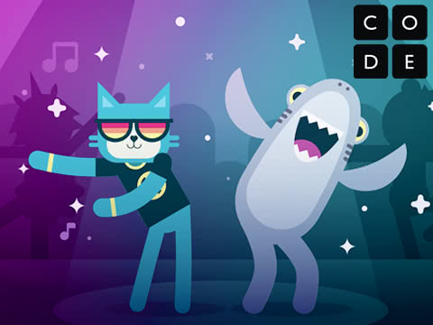
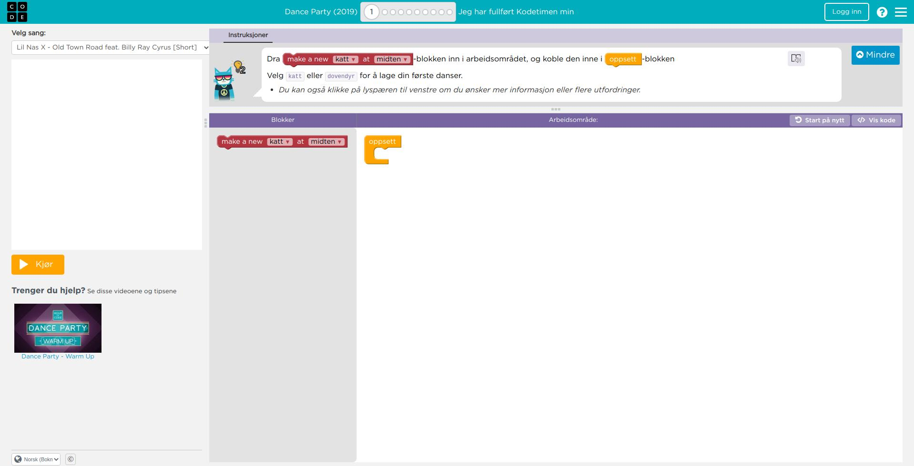
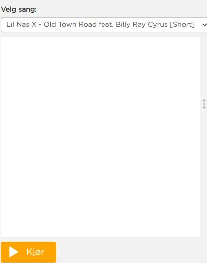
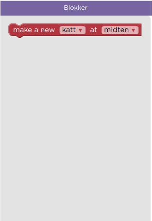

# Introduksjon {.intro}

## {.tip}
Dette dokumentet er rettet mot voksne kodeveiledere, for eksempel i anledning Kodetimen. Selve opplegget finner du ved å følge lenken under.
#

I denne oppgaven skal elevene lære om noen grunnleggende programmeringsprinsipper gjennom å få danserne på skjermen til å utføre ulike dansebevegelser til musikken. Dere kan godt gjennomføre [Dansefest - Uten datamaskin](https://oppgaver.kidsakoder.no/uten_datamaskin/Dansefest/Dansefest){target=_blank} enten før eller etter dette opplegget, for å få inn litt tilhørende fysisk aktivitet i tillegg.

I Code Studio bruker man videoer til å introdusere oppgaver eller nye programmeringskonsepter underveis. Disse er på engelsk, med (delvis) norsk tekst. Det kan være lurt at den som skal veilede i Kodetimen har gått gjennom disse videoene og forsøkt å løse oppgavene selv før man gjennomfører Kodetimen i klasserommet. Spesielt hos yngre elever bør læreren ha sett gjennom videoene og være klar til å oversette/forklare nye konsepter i forkant eller underveis.

Husk å lese lærerveiledningen om du trenger tips til kompetansemål, læringsmål eller eksterne ressurser.

[Trykk her](https://studio.code.org/s/dance-2019/stage/1/puzzle/1){target=_blank} for å komme til oppgaven, eller les videre om du ønsker litt mer info først.

# Hva har dans og koding felles? {.activity}

Dans og koding har mye til felles, blant annet at man må bli enige om hva som skal skje når - og hvem som skal gjøre det. Koreografien i dans kan helt fint skrives ved hjelp av kode. Man kan for eksempel gjenta bevegelser et bestemt antall ganger (løkker) og endre dansebevegelse eller posisjonering på gulvet på bestemte steder i musikken (hendelser).

Det er ofte i møtet mellom digital teknologi og helt andre ting at man plutselig oppdager nye muligheter. Dersom man utstyrer dansere med klær som har innebygget elektronikk, kan man skape nye uttrykk og opplevelser for publikum. Digital teknologi gir fantasien fritt spillerom, og man kan skape ting som bare for et tiår eller to siden var science ficiton.

# Code Studio {.activity}

Code Studio er navnet på grensesnittet man jobber i hos code.org. Code Studio er blokkbasert, altså skriver man kode med blokker (tenk Lego eller puslespill), i stedet for å skrive tekst. Alle oppgavesettene i Code Studio følger det samme desginet, så har du gjort en oppgave i Code Studio før, kjenner du deg raskt igjen i nye oppgaver.

Nå skal vi gå gjennom de ulike elementene i Code Studio for Dansefest og kort beskrive deres funksjon.

## Sjekkliste {.check}

- [ ] Sånn ser Code Studio ut når du går inn i Dansefest-oppgaven:

- [ ] Øverst finner du oversikten over hvor mange oppgaver som gjenstår. Hvit farge betyr at oppgaven ikke er gjort, grønn betyr fullført:

- [ ] Under oppgaveoversikten finner du instruksjonene til oppgaven:

- [ ] Til venstre på skjermen finner du "Scena" - der danserne danser til musikken. Merk at du kan velge musikk fra menyen over scena. Trykk "Kjør" når du er ferdig med å skrive koden for å se om det ble riktig:

- [ ] Midt på skjermen finner du verktøykassa. Her finner du alle tilgjengelige kodeblokker som kan brukes i oppgaven. Det kommer til nye kodeblokker utover i oppgavene:

- [ ] Arbeidsflata er det store, hvite feltet på høyre side av skjermen. Det er her man bygger opp koden sin. Pass på at kodeblokkene plasseres i riktig rekkefølge! Øverst kan man se hvor mange kodeblokker man har brukt, og hvor mange som er nødvendig for å løse oppgaven. Øverst til høyre kan man velge å vise koden som tekstkode (JavaScript), eller tømme hele arbeidsflaten og begynne oppgaven på nytt.:

- [ ] [Trykk her](https://studio.code.org/s/dance-2019/stage/1/puzzle/1){target=_blank} for å komme til oppgaven. Lykke til!
