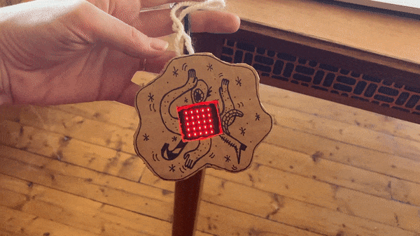

# Introduksjon {.intro}

I denne oppgåva skal heile klassen laga julepynt med micro:bit, som kan vera fjernstyrt av ein annan micro:bit. Når de er ferdige med oppgåva, kan de henga microbitane på juletreet som pynt!



Fjernkontrollen styres av læraren. Han styrer heile klassen.


# Steg 1: Hent data sent av fjernkontrollen {.activity}

## Sjekkliste {.check}

- [ ] Læraren sin micro:bit er programmert for å senda beskjed på ein spesiell radiobølge. Han/ho skal seie til dokker kva radiokanal han bruker. Bruk den same radiokanalen for å henta informasjon han/ho sender med fjernkontrollen (i mitt eksempel: `7`):

```microbit
radio.setGroup(7)
```

- [ ] No treng me ein variabel `vispynt`{.microbitvariables} som skal halda informasjonen som læraren sin microbit sender med radiobølger. Trykk på `variabel`{.microbitvariables} i venstre-menyen. Lag ein ny variabel og kall han for `vispynt`{.microbitvariables}.

- [ ] Deretter kan du dra ein kloss i `ved start`{.microbitbasic}, som skal setta variabelen `vispynt`{.microbitvariables} til `ingen` når micro:biten blir slått på.  

```microbit
radio.setGroup(7)
let vispynt = ""
vispynt = "ingen"
```

- [ ] Målet med variabelen `vispynt`{.microbitvariables} er at han skal halda beskjeden frå fjernkontrollen. No skal me skrive kode for å setja `vispynt`{.microbitvariables} til verdien som fjernkontrollen sender.

```microbit
radio.onReceivedNumber(function (receivedNumber) {
    vispynt = receivedString
})
```

# Steg 2: Vis ein animasjon {.activity}
##

- [ ] No skal me skrive ein vilkår: viss fjernkontrollen sender `firkant`, så skal din micro:bit gjennomføre koden som er under.

```microbit
basic.forever(function () {
    if (vispynt == "firkant") {
    } else  {
    }
})
```

- [ ] Om `vispynt`{.microbitvariables} har `firkant` som verdi, så skal microbiten vise ein firkant animasjon. Me bruker `pause (20)`{.microbitbasic} slik at me ser bildet for 20 millisekund før koden går vidare til neste bildet.

```microbit
basic.forever(function () {
    if (vispynt == "firkant") {
        basic.showLeds(`
            . . # . .
            . # # # .
            # # # # #
            . # # # .
            . . # . .
            `)
        basic.pause(500)
        basic.showLeds(`
            . . . . .
            . # # # .
            . # # # .
            . # # # .
            . . . . .
            `)
        basic.pause(500)
    } else {
    }
})
```

# Prøv sjølv {.try}
- Du kan teikna figurane som du vil, så lenge dei har firkanta form. Du kan legga til fleire klossar om du vil ha ein animasjon med fleire figurar.
- Du kan også bruka ikon (i `Basis`{.microbitbasic} kan du finna `vis ikon`{.microbitbasic}).
#

## Test prosjektet {.flag}
- Overfør koden til din microbit: du kan bruke ein kabel eller bluetooth for å kobla saman PC-en du bruker og microbiten:


- og deretter øverføra koden til micro:biten ved å trykkja på `last ned`:


- Funker koden? Når læraren har trykt på `A` på fjernkontrollen, bør micro:biten din vise animasjonen du har laga med bilde eller ikon.
#

# Steg 3: Tøm skjermen {.activity}
##

- [ ] Tilsett eit anna vilkår: om fjernkontrollaren sender `ingen` (og dermed `vispynt`{.microbitvariables} = `ingen`), skal microbiten ha tom skjerm.

```microbit
basic.forever(function () {
    if (vispynt == "firkant") {
        basic.showLeds(`
            . . # . .
            . # # # .
            # # # # #
            . # # # .
            . . # . .
            `)
        basic.pause(500)
        basic.showLeds(`
            . . . . .
            . # # # .
            . # # # .
            . # # # .
            . . . . .
            `)
        basic.pause(500)
    } else if (vispynt == "ingen") {
        basic.clearScreen()
    }
})
```

## Test prosjektet {.flag}
- Overfør koden til din micro:bit.
- Funker koden? Når læraren har trykt på `A` på fjernkontrollen, bør micro:biten din vise animasjonen du har laga med bilde eller ikon. Når læraren trykkjer på `B` på fjernkontrollen, bør skjermen bli tom.
#

## Utfordring {.challenge}
No skal micro:biten til læraren sende eit nytt ordre: "din pynt". Kan du laga din eigen julepynt og skrive koden sjølv?

### Tips
- Fyrst og fremst må du laga ein ny vilkår med ein ny "ellers" linje (eller "else if") på din "viss" blokk. Der treng du ein vilkår som sjekker at fjernkontrollaren sente "ditt pynt" (så: `vispynt`{.microbitvariables} = `“ditt pynt”`.
- For å teikna din eigen pynt kan du bruke 3 metodar: `ikon`{.microbitbasis} / `bilde`{.microbitbasis} / `xy-koordinat`{.microbitmatematikk}.
- Om du vil ha ein suksesjon av bilder, hugs å bruke ein liten `pause`{.microbitbasis} mellom kvart bilde.
#

## Lagre og øverfør til micro:bit {.save}

# Steg 4: pynt din micro:bit {.activity}
#

Du har progammert micro:biten slik at han viser fleire animasjonar avhengig av ein fjernkontroll. Pynt din micro:bit for du heng han i juletreet!

## Sjekkliste {.check}

- [ ] Lag ein figur av papp.
- [ ] Lag eit firkant-hull som er akkurat så stor som micro:biten.
- [ ] Fest microbiten til figuren med teip.
- [ ] Fest batteri til microbiten og figuren, også med teip.
- [ ] Fest tråd til figuren, slik at du kan henga han opp.
- [ ] Teikna på pappen for å pynta den litt meir.
- [ ] Du kan òg lime på glitter, små stjerner eller annan pynt for å gjere pynten endå meir fjong!


### Viss de har juletre på skulen, kan micro:bitane henges til pynt der, eller kanskje som pynt i klasseromsvindauget?
