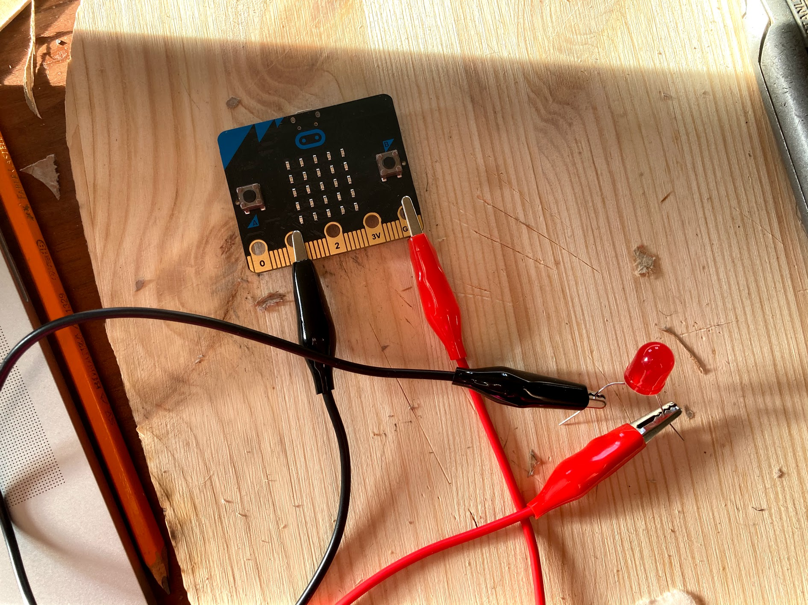
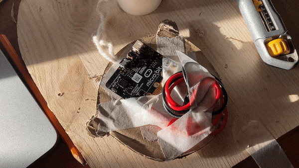
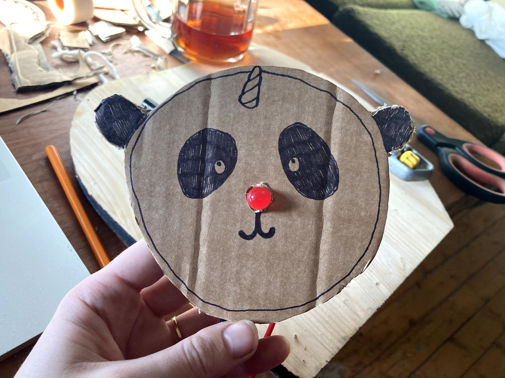
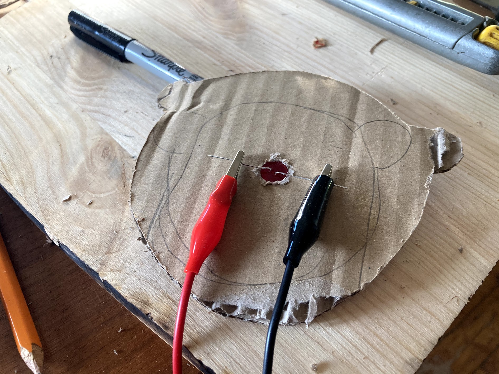
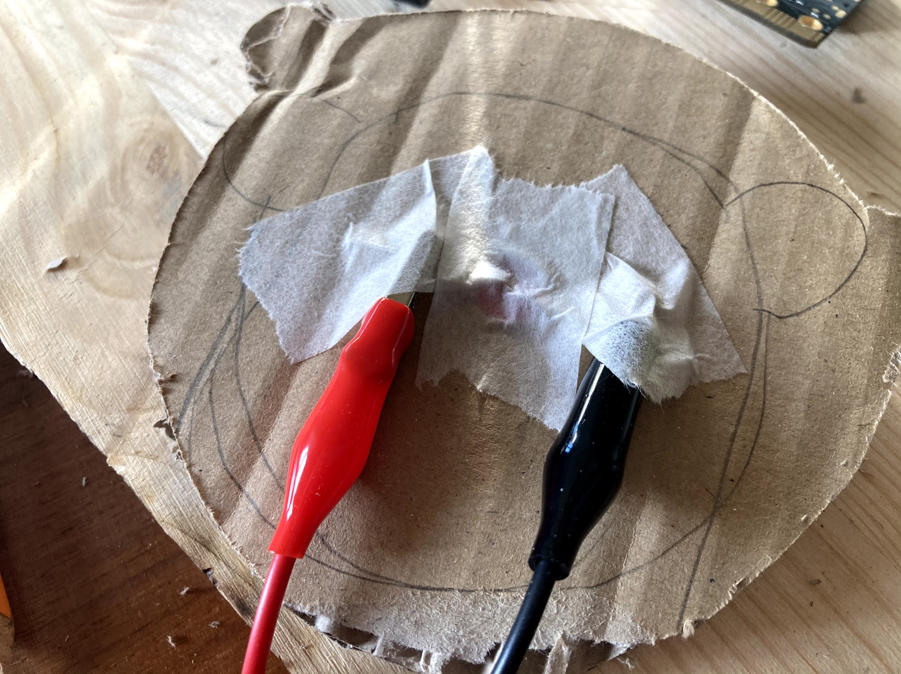
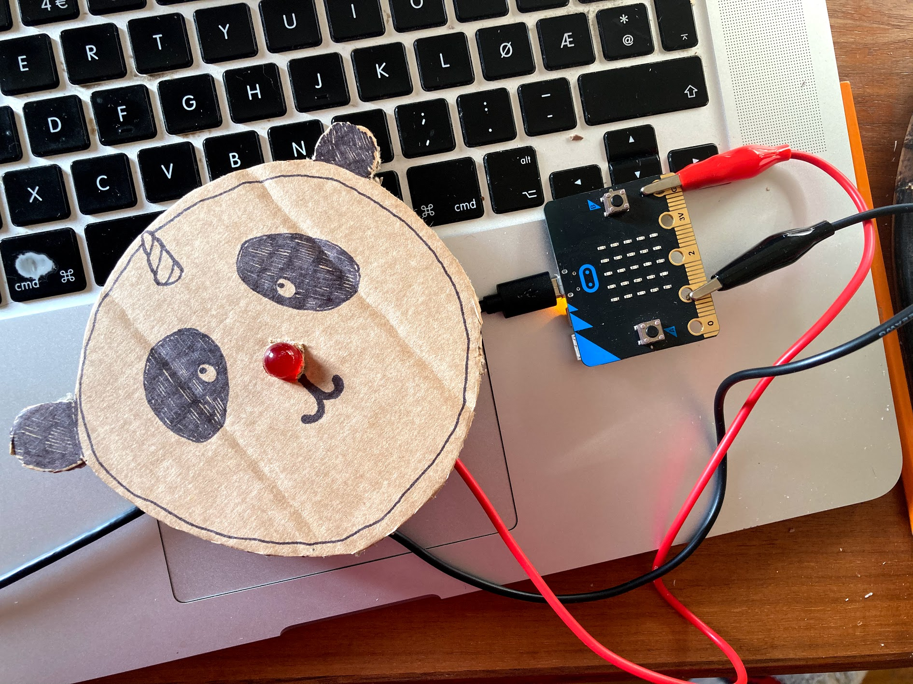

# Introduksjon {.intro}

I denne oppgåva skal me laga eit nattlys som slår seg på når det blir mørkt ute. Her er eit eksempel på korleis det kan sjå ut:


# Steg 1: Programmer micro:biten {.activity}
#

Me skal programmera micro:biten slik at han slår LED-lyset på når det er mørkt. Opna [makecode](https://makecode.microbit.org) og trykk på `nytt prosjekt`. Kall prosjektet for `nattlys`.

## Sjekkliste {.check}

- [ ] Skriv eit vilkår som seier at `viss`{.microbitlogic} `lysnivå`{.microbitinput} `er null`{.microbitlogic}, må denne koden køyrast:

```microbit
basic.forever(function () {
    if (input.lightLevel() == 0) {
    }
})
```

- [ ] Skriv koden som må køyrast når det er mørkt. Me vil ha lys på. I `avansert` kan du finna `Tilkobling`{.microbitpins}, og i `Tilkobling`{.microbitpins} kan du finna `skriv digital til P0 verdi (0)`{.microbitpins}. Bytt P0 med P1. `Verdi (0)`{.microbitpins} betyr at det er ingen elektrisitet som skal i krets. Då blir lyset ikkje på. Da må du skrive `1` i staden for `0`.

```microbit
basic.forever(function () {
    if (input.lightLevel() == 0) {
        pins.digitalWritePin(DigitalPin.P1, 1)
    }
})
```

- [ ] No skriv me koden som skal køyrast når det er lyst om dagen. Då vil me slå lyset av.

```microbit
basic.forever(function () {
    if (input.lightLevel() == 0) {
        pins.digitalWritePin(DigitalPin.P1, 1)
    } else if (input.lightLevel() > 0) {
        pins.digitalWritePin(DigitalPin.P1, 0)
    }
})
```

## Test prosjektet {.flag}
- Overfør koden til din micro:bit. Du kan bruke ein kabel eller bluetooth for å kobla saman PC-en du bruker og microbiten:


- og deretter overføre koden til micro:biten ved å trykkja på `last ned`:


- Kobla din microbit til LED-lyset med krokodilleklemme, slik som på bildet:



- Funker koden? Blir lyset slått på når du legg handa di over skjermen på micro:biten? Då blir det mørkt for sensoren og lyset skal slå seg på!



#

## Utfordring {.challenge}
Kan du skrive kode som gjer at lyset blinker i staden for å lyse konstant?

### Tips
Digital lys har to moglege verdier:
- `1` betyr at lyset er på
- `0` betyr at lyset er av

Koden som du skriver bør ha denne rekkefølgja:
- lys på
- pausa for 100 millisekund
- lys av
- pausa for 100 millisekund

#

## Lagre og overfør til micro:biten {.save}
#

# Steg 2: Lag ditt nattlys {.activity}
#

## Sjekkliste {.check}

- [ ] Lag din nattlys med papp (eller andre materialer). Her er eit eksempel med Pandacorn. Lag eit hòl til nesa, og stikk LED-pæra gjennom hòlet.



- [ ] Ha krokodilleklemme på kvart bein av LED-pæra og fest med teip.





- [ ] Kobla saman med micro:biten. Pass på at du koplar leidningane rett!



- [ ] Fest micro:biten og batteriet på baksida av pappfiguren med teip. Pass på at du ikkje festar noke over skjermen på micro:biten, fordi det er der lyssensoren er. På dette bildet er ikkje batteriet festa på endå.


- [ ] Du kan testa ditt prosjekt ved å ha handa di på baksida av microbiten. Då blir sensoren i mørket og nesa skal slå seg på!


#
## Heng nattlyset mot vindauget {.save}

Når det blir mørkt ute, skal lyset slå seg på!


