# Introduksjon {.intro}


I denne oppgåva skal me laga ei nettside med tekst og bilete. Du skal lage ein hyllest til nokon som inspirer deg. I eksempelet har eg valgt Barbara Butch, som er ein fransk aktivist for eit meir inkluderande samfunn.


Me skal bruke Trinket, som me kan bruke både til tekstredigering (for å skrive koden) og som nettleverandør (for å publisera nettsida på internet).


# Steg 1: Opprett eit nytt prosjekt i Trinket {.activity}


Her skildrar du hva som er målet med steget.


## Sjekkliste {.check}


- [ ] Opne Trinket.io og opprett ein brukarkonto. Du treng ei e-post adresse til det. Endra ditt brukarnamn til eit kallenamn du vel.


- [ ] Klikk på denne lenkje for å opne tekstredigeringsprogrammet for HTML/CSS: [trinket.io](https://trinket.io/html/2f80b9fea1){target=_blank}. Klikk deretter på `remix`. Då kan du redigera koden.


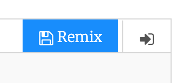


## {.tip}
HTML er ein spesifikk måte å skrive innhaldet til ei nettside.
##


- [ ] Slik ser det ut:


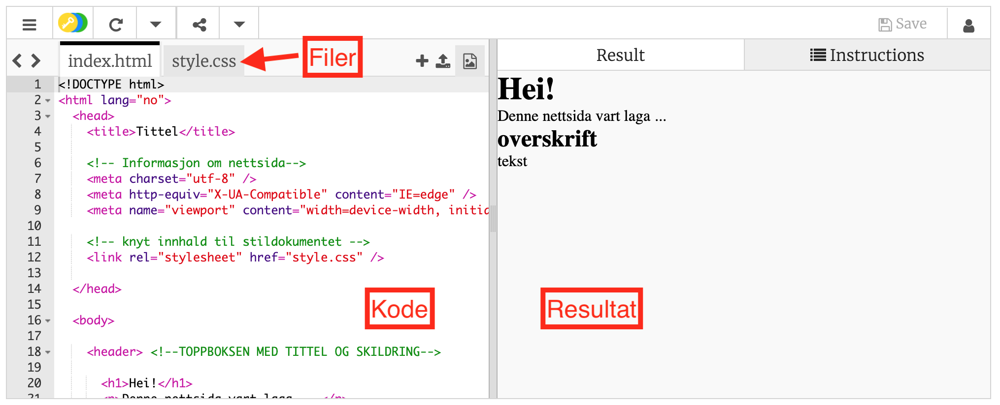


- [ ] I prosjektet ditt har du to filer: `index.html`, som er der teksten og bileta ligg, og `style.css`, som gjev instruksjonane om utsjånad.


- [ ] Publiser nettsida di: trykk på "save", også trykk på "share", deretter på "publish". Ein boks blir opna. Trykk igjen på "publish". Ho er no på nett!


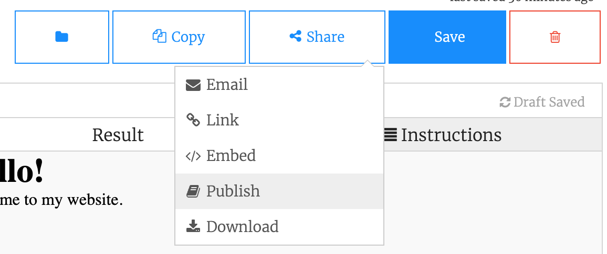

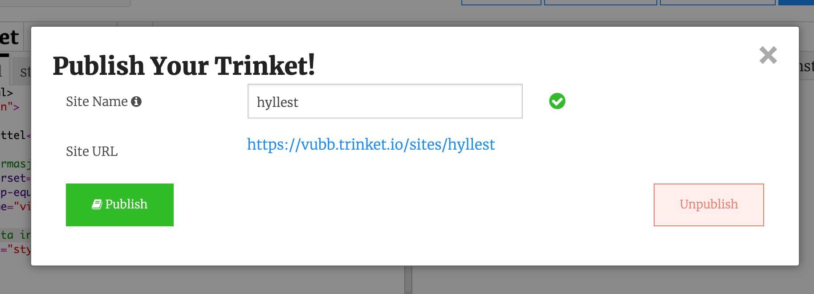


- [ ] Trykk på lenkja til nettsida di, `site URL`. Og opne den i ei ny fane. Kvar gong du forandrer koden i Trinket, kan du besøkja nettsida di og trykkja på `ctrl` + `R` for å oppdatera det som du ser.


# Steg 2: Skriv innhald til nettsida di {.activity}


No skal me ha på plass alle tekstane og bileta som skal ligga på nettsida. Ein del av koden er på plass. No skal me fylla inn.


Teksten i `index.html`har fleire ulike fargar. På nettsida ser me bare teksten som er i svart i redigeringsprogrammet! Resten har andre funksjonar. Til dømes: Det som me kallar for "tag" er rosa.
##

- [ ] Lag ein introduksjon til nettsida. I `<header>`-boksen kan du skrive eit kort innlegg som oppsummerer nettsida di. I mitt eksempel:


## {.tip}
`<h1>`, `<h2>`, `<h3>` er til overskrift. `<p>` er til vanleg tekst.
##


- [ ] No som me har ein `header` med tekst kan me gå vidare og velja tekst og bilde til `main`. Me vil laga ei nettside med fleire boksar, med tekst eller bilete i kvar boks, slik som her:


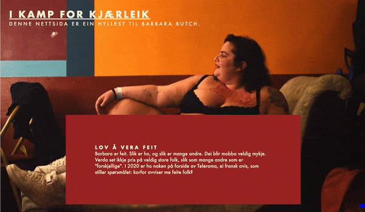


Me kan laga ein boks ved å bruka tag `div` i HTML. Slik gjer du: `<div class="classNamn">Boks-innhald </div>`. Og du kan skrive inn overskrift og tekst med `<h2>` og `<p>`:


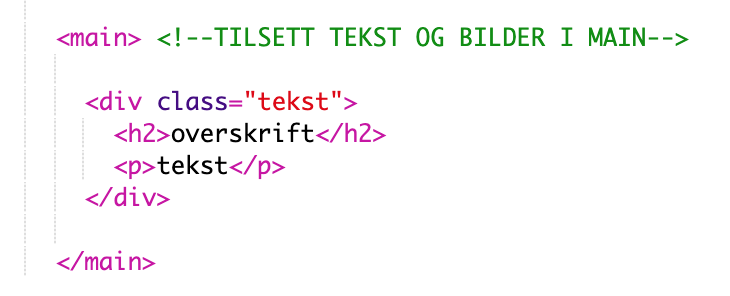


- [ ] Legg til meir tekstboks (og skriv inn din eigen tekst):


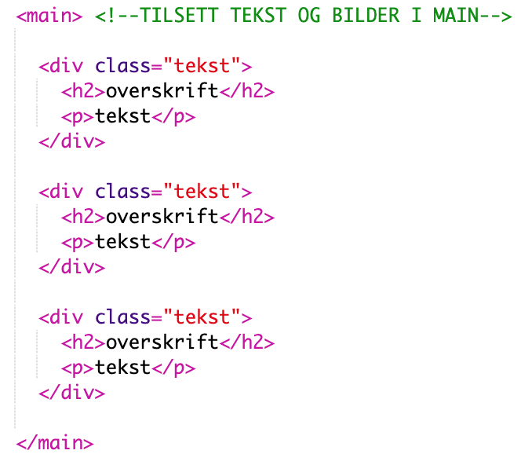


I mitt eksempel ser nettsida slik ut:


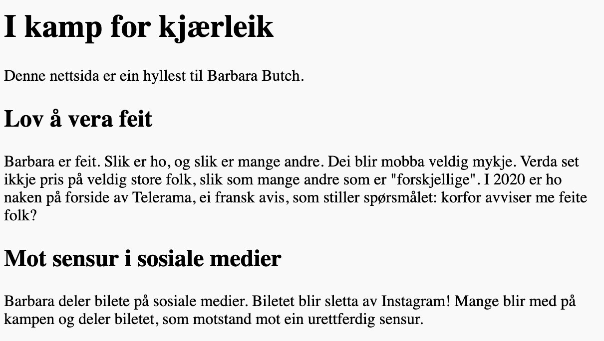


- [ ] Slik kan du legga til ei lenkje:


Med `href` for å gje lenkja og `target="blank"`for å opna lenkja i ei ny fane. Lenkja kan du skrive i ein tekst-boks, under `<p>` teksten. Slik kan det sjå ut:


- [ ] Legg til eit bilde-boks. Finn eit bilde på internet og kopier adressa til bildet. Lim inn adressa.


Det er best å skrive informasjon om bildet i tillegg, det gjer du slik:


```web

```


- [ ] Under `main`, legg til `footer` med bilde-godskriving:


## Tips {.tip}
Merk at `` er ein av dei einaste taggane utan lukke-tag `</img>` etter seg.
##


## Test prosjektet {.flag}

**Trykk på `save`. Gå på nettsida di og trykk på `ctrl`+ `R`.**

- [ ] Du skal sjå at teksten og bildet er på plass, utan stil.


# Steg 3: Legg til CSS {.activity}


I dette steget skal me legga til ein css, som innheld stilen til nettsida. No skjer det ikkje lenger i `index.html` men i `style.css`.


## Sjekkliste {.check}


- [ ] Legg til eit bakgrunn. I `body, html { }`, skriv:


Vel sjølv kva bilde du vil bruka ved å endra adressa til bildet.

## Ting å prøva {.try}
Kva skjer om du sletter linja `backgorund-size:cover;`?
##

- [ ] La oss velja fonten til nettsida under linjene for bakgrunn:


## Ting å prøva {.try}
Vel sjølv kva farge du vil bruka. Ei fargeliste finn du [her](https://www.w3schools.com/colors/colors_names.asp){target=_blank}.
##


- [ ] No kan me endra designet til `header` ved å velja utsjånad til teksten og ved å gje litt luft rundt boksen:


## Ting å prøva {.try}
Prøv å endra talet bak `letter-spacing`!
##


- [ ] Understrek tittelen:


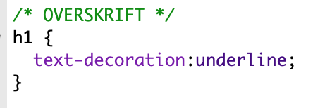

## Ting å prøva {.try}
Du kan prøva andre parameter: `overline` eller `line-through`!
##


- [ ] Legg til farge, vel størrelse, vel avtstand mellom tekst boksene:


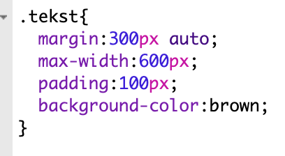


## Ting å prøva {.try}
- Du kan endra fargen til bakgrunnen til tekst-boksane.
- Prøv å endra margin og padding. Kva forskjell ser du mellom dei to?
##


- [ ] Legg til stil på lenkja:


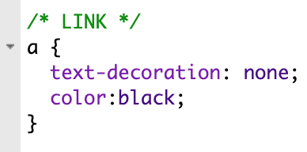


- [ ] Rediger storleik og posisjonen til bildet og bildeboksen:


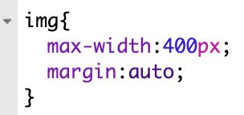
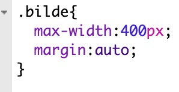


- [ ] Til slutt: Legg stil på `footer`-boksen:


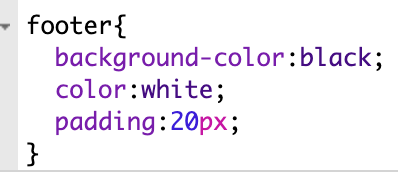


#
## Test prosjektet {.flag}


**Trykk på `save`. Gå til nettsida di og trykk på `ctrl`+ `R`.**


## Lagre og del {.save}


No har du ei ferdig nettsida!! Du kan dela adressa for at andre skal besøkja nettsida di!
